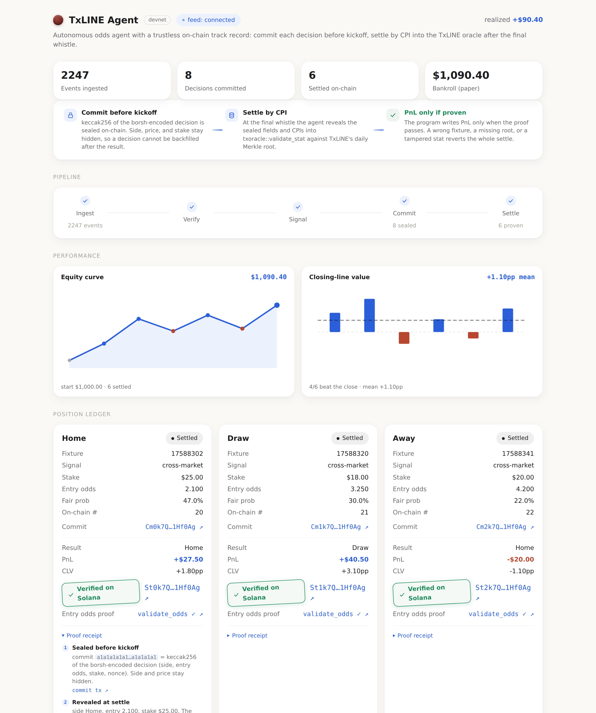
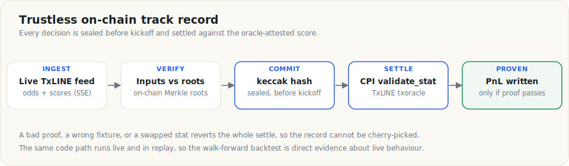

# 🤖 TxLINE autonomous odds-trading agent

    



> The operator console: live feed status, the ingest-to-settle pipeline, and the position ledger with on-chain "Verified on Solana" stamps.

An autonomous, deterministic agent that ingests the live TxLINE World Cup feed (odds and
scores, Merkle-anchored on Solana), trades a **cross-market relative-value strategy** across the
full odds surface, and keeps a **trustless, non-cherry-picked on-chain track record**: every
decision is hashed on-chain before kickoff and settled by a CPI into TxLINE's own
`txoracle::validate_stat`, so PnL is only writable when the oracle-attested score matches the
sealed claim.

Submission for the TxODDS "Trading Tools and Agents" World Cup hackathon (Superteam Earn). Devnet
and paper trading only; it places no real-money wagers.

## 🎯 Why this is different

Most entries print signals. The hard problem the sponsor named is that **matches finish after the
deadline, so there is no live activity at judging time** and any claimed track record can be
cherry-picked. This agent answers that with a verifiable chain rather than a screenshot:

1. **Committed decisions.** Before kickoff the agent writes `keccak256(borsh(side, fair prob,
   entry odds, stake, signal, nonce))` on-chain. Side, price, and stake are sealed, so a decision
   cannot be backfilled or altered after the outcome is known.
2. **Oracle-verified outcomes.** At settle, a CPI into `txoracle::validate_stat` proves the final
   score satisfies the sealed claim against TxLINE's own on-chain Merkle root; the program writes
   PnL only if the proof passes. A bad proof, a wrong fixture, or a tampered stat reverts the whole
   settle. Every settled result is therefore proven, not asserted.



The same code path runs live and in replay, so the walk-forward backtest is direct evidence about
live behaviour, not a separate script.

## 📊 Status

M0-M9 complete, followed by a review-and-harden pass, a cross-market strategy upgrade (a
goals-model relative-value signal across the full odds surface, replacing steam-following), an
independent Elo market-decorrelation stake overlay, and an implemented on-chain entry-odds proof
(`prove_entry_odds` via `txoracle::validate_odds`). **295 TypeScript tests + 12 Rust tests (307
total), all green**, with `typecheck`, `lint`, a coding-standards gate, and a core-purity gate all
passing. The `agent_ledger` program is deployed and the full settle trust chain is proven on devnet
(commit before reveal, CPI-settle, and three rejection cases: tampered root, mismatched fixture,
swapped stats). The entry-odds proof is verified offline (program tests plus a cross-language borsh
golden) and ships ready to deploy: because it adds a `DecisionCommit` field, going live is a
coordinated devnet upgrade on a fresh strategy, so it is not yet on the deployed program. A
security audit ([docs/audit/M8-audit.md](docs/audit/M8-audit.md)) closed two
critical settlement trust gaps, which are fixed, deployed, and re-proven on-chain; the later
hardening pass added defense-in-depth (a sealed-side guard, a checked epoch-day derivation,
secret redaction on error paths, and settlement seq-ordering integrity) and broader edge-case
tests.

| Devnet artifact | Address |
| --- | --- |
| `agent_ledger` program | [`FLZiKMUaPAGMtPLbfHvHwfiVfkTZD8RZ84CSrkDy1kLD`](https://explorer.solana.com/address/FLZiKMUaPAGMtPLbfHvHwfiVfkTZD8RZ84CSrkDy1kLD?cluster=devnet) |
| TxLINE `txoracle` (CPI target) | `6pW64gN1s2uqjHkn1unFeEjAwJkPGHoppGvS715wyP2J` |
| Strategy authority wallet | `8SafovV7444FGu3fGUJDWiqkrwsLpamsCH7buQyjKe5P` |

## 🏗️ Architecture

A TypeScript monorepo (pnpm + Turborepo) plus an Anchor 0.31.1 Solana program. Strict layering,
enforced by ESLint and a CI grep: `core` depends on nothing and does no IO.


```
core           pure quant + domain + decision logic (cross-market goals model, de-vig, Kelly, CLV + bootstrap CI, calibration)
txline         TxLINE REST + SSE client, zod schemas, LiveSseFeed + ReplayFeed, resilience
onchain-client @solana/kit client: commit/settle, the validate_stat CPI args, account decoders
agent          composition root: LiveSseFeed -> runPipeline -> an on-chain sink; state store
api            read-only HTTP + SSE projection of the agent's state (node:http, no framework)
backtest       replay harness: CLV, calibration, drawdown, walk-forward; deterministic report
dashboard      Vite + React operator console, reads the API over HTTP/SSE only
programs/agent_ledger   the Anchor program: commit-reveal + the validate_stat CPI settle
```

Design tenets: one code path for live and replay; full determinism (injected `Clock` and seeded
PRNG, no `Date.now()` / `Math.random()` in decision code); zod at every ingress; errors as values;
money as integers (`MicroUsd = bigint`, odds x1000).

## ⚡ Quickstart (for judges)

Prerequisites: Node >= 22, pnpm 11, and (for the live agent and the on-chain proof) a `.env` with
the TxLINE token and a devnet wallet; see [docs/runbooks/M6-agent.md](docs/runbooks/M6-agent.md)
and [docs/runbooks/M4-devnet.md](docs/runbooks/M4-devnet.md).

```bash
pnpm install
pnpm verify            # typecheck + 295 tests + lint + standards + core-purity, all green
```

Run the backtest (the proof centerpiece; needs the TxLINE token). `backtest:sweep` aggregates the
group stage into one Closing-Line-Value report with a bootstrap confidence interval; `backtest:run`
replays a single window. Both write `backtest/out/report.{md,html}`:

```bash
pnpm --filter @txline-agent/devnet-tools backtest:sweep   # group-stage CLV report (with CI)
pnpm --filter @txline-agent/devnet-tools backtest:run     # single window
```

Run the headless agent plus the operator dashboard:

```bash
pnpm build
pnpm --filter @txline-agent/api start          # agent + read-only API (needs .env)
pnpm --filter @txline-agent/dashboard dev      # http://localhost:5173
```

Or in Docker (builds and runs the agent + API; mount the wallet read-only, pass the token):

```bash
docker build -t txline-agent .
docker run --rm -p 8080:8080 --env-file .env \
  -e AGENT_KEYPAIR_PATH=/run/keypair.json \
  -v "$HOME/.config/solana/id.json:/run/keypair.json:ro" txline-agent
```

Prove the trust chain on devnet end to end (commit -> CPI-settle -> reject a tampered proof, a
mismatched fixture, and swapped stats):

```bash
pnpm --filter @txline-agent/devnet-tools settle:e2e
```

## 📈 The strategy

TxLINE serves a single de-margined consensus price (`TXLineStablePriceDemargined`, booksum ~ 1),
so a naive Kelly +EV bet sizes to zero and a de-margined consensus cannot be out-forecast. The
agent instead trades **cross-market relative value**: for each fixture it fits one Dixon-Coles
goals model (parametrized by supremacy and total goals) jointly to the full surface the feed
serves (1X2 + the Over/Under total-goals ladder + the Asian-Handicap ladder), then backs the 1X2
leg the joint fit prices longer than the 1X2 line implies (the lagging leg, after Kaunitz et al.
2017), sized by a real positive Kelly edge and entered in the liquid near-kickoff window. It
reports Closing Line Value with a bootstrap confidence interval, calibration (Brier, log loss),
hit rate, and drawdown over a walk-forward split. The math is pure and deterministic, in `core`
with golden tests.

The honest framing: the edge is cross-market consistency and slow-leg timing, not beating an
efficient market. Over the World Cup group stage (10 match-days, 22 settled bets), the mean Closing
Line Value is **+0.0024 (95% bootstrap CI [-0.0007, +0.0057]), with 59% of bets beating the
pre-kickoff close**, against the prior steam strategy's -0.0424 on 8 bets (12.5% positive). The
point estimate is positive and a majority of bets beat the close; the interval narrowly includes
zero, so this is a small, honestly-bounded edge, not a proven one. Closing Line Value (not the
variance-driven +41% ROI over 22 long-odds-leaning bets) is the leading indicator a desk tracks,
and it is reported only over bets that had a known pre-kickoff closing line.

**Independent rating, decorrelated.** A frozen World Football Elo rating is layered on as a
market-decorrelation overlay, not a second forecast. A standalone rating does not beat a
de-margined consensus out-of-sample (Hvattum and Arntzen 2010; Wunderlich and Memmert 2018), and a
rating correlated with the price is unprofitable however accurate (Hubacek et al. 2019), so the
agent acts only on the rating's residual after orthogonalizing against the consensus, as a bounded
confidence weight on the Kelly stake (up to 1.25x on corroboration, 0.5x on contradiction, never a
gate). It is a calibration overlay, not a new edge source; the constants are frozen from the
published method rather than tuned on the agent's own bets, and the sweep reports Closing Line Value
with and without it so the effect is measured, not assumed.

## 🔗 On-chain program

`agent_ledger` (paper trading only, no real funds). One `Strategy` ledger per agent; one
`DecisionCommit` per decision. `settle_decision` recomputes the keccak commit hash, derives the
1X2 predicate from the claim, re-derives the daily scores roots PDA, and CPIs into
`validate_stat`; it binds the proof to the committed fixture and pins the participant goal stat
keys, so a settle cannot substitute a fixture or swap stats to fabricate a result.

An implemented, offline-verified extension, `prove_entry_odds`, proves the **entry price** too:
after settle it re-checks the sealed reveal, binds the snapshot's price for the committed side to
the sealed entry odds, re-derives the daily odds-roots PDA, and CPIs into `txoracle::validate_odds`
against the published odds Merkle root, so the committed entry price cannot be backfilled any more
than the outcome can. It is covered by program tests and a cross-language borsh golden; because it
adds a `DecisionCommit` field, deploying it is a coordinated devnet upgrade on a fresh strategy, so
the live program currently runs the commit-and-settle chain. Verification type details and the
trust model are in [docs/submission/TECHNICAL.md](docs/submission/TECHNICAL.md).

## 📦 Submission

- Demo video script: [docs/submission/DEMO-SCRIPT.md](docs/submission/DEMO-SCRIPT.md)
- Technical documentation and TxLINE API feedback: [docs/submission/TECHNICAL.md](docs/submission/TECHNICAL.md)
- Security audit: [docs/audit/M8-audit.md](docs/audit/M8-audit.md)
- Build plan and milestones: [docs/BUILD_PLAN.md](docs/BUILD_PLAN.md)

## 🔒 Security and compliance

Devnet and paper trading only; no real-money wagering. Secrets come from env, are never logged or
committed (RPC errors are redacted before they reach logs or the public state endpoint), and the
`.env` and keypair files are gitignored. The repository follows a strict coding standard and a
security-audit procedure (the full audit ran at M8, with a follow-up review-and-harden pass over
every package).
